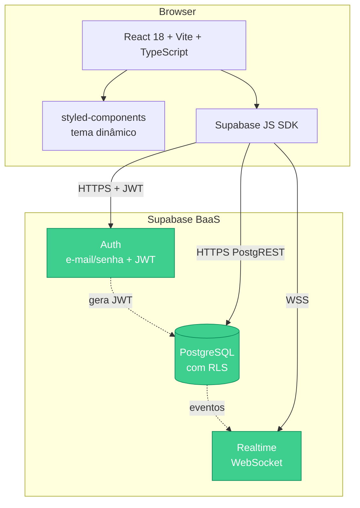
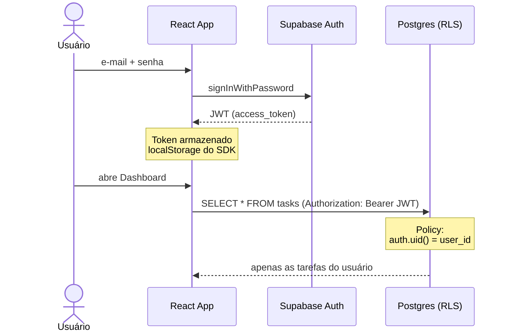
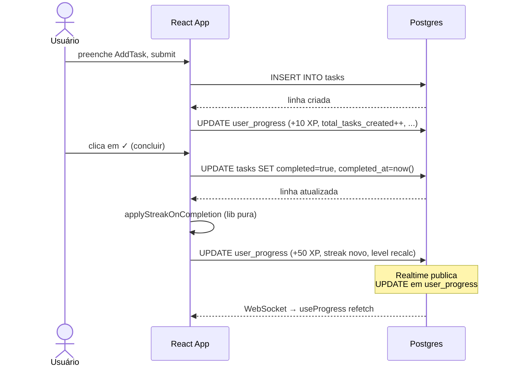
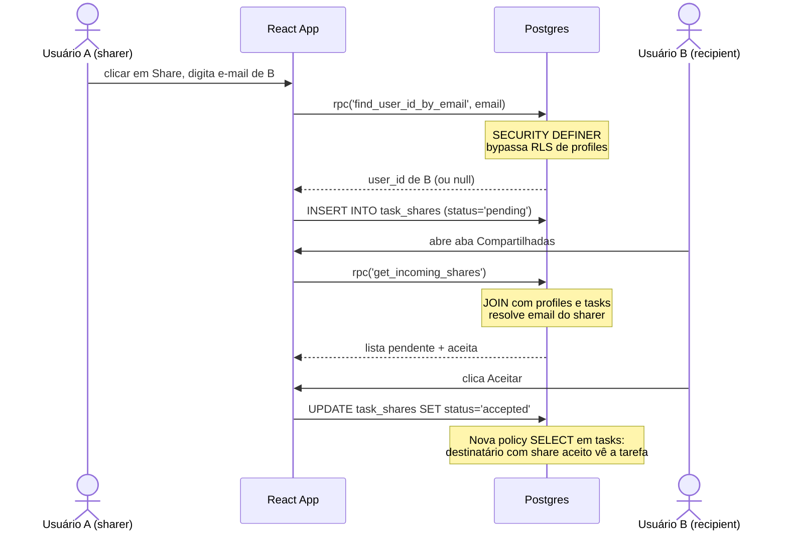
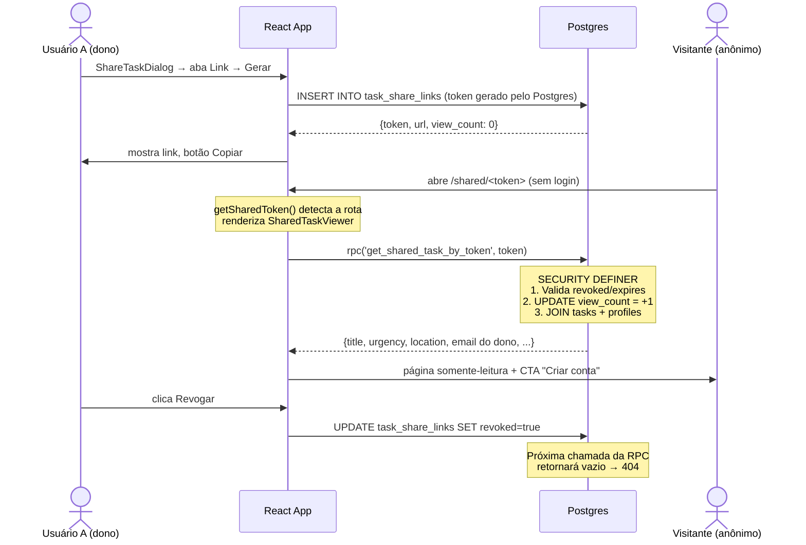

# Arquitetura

## Visão geral



## Camadas

### Frontend (browser)

- **React 18** com hooks customizados ([useTasks](../src/hooks/useTasks.ts), [useProgress](../src/hooks/useProgress.ts), [useAnalytics](../src/hooks/useAnalytics.ts), [useShares](../src/hooks/useShares.ts), [useAuth](../src/hooks/useAuth.ts), [useTheme](../src/hooks/useTheme.ts)).
- **styled-components 6** para estilização (CSS-in-JS), com tema dinâmico claro/escuro plugado via `ThemeProvider`.
- **Vite 5** como bundler. Code-splitting via `React.lazy` para o módulo de Análises (recharts é pesado).
- **Supabase JS SDK** como única dependência de comunicação com o backend.
- **Sem servidor próprio.** Toda lógica que não cabe no cliente vai para PL/pgSQL no banco.

### Backend (Supabase BaaS)

- PostgreSQL gerenciado, com **Row Level Security** habilitada em todas as tabelas.
- Auth gerencia sessão JWT.
- Realtime publica mudanças via WebSocket — usado em [useProgress](../src/hooks/useProgress.ts) para refletir XP/streak em tempo real.
- Lógica de domínio que precisa bypass de RLS (lookup por e-mail, JOIN de shares com profiles): **funções PL/pgSQL `SECURITY DEFINER`**.

## Fluxo: autenticação



## Fluxo: criar e completar tarefa



## Fluxo: compartilhamento



## Fluxo: link público



## Row Level Security — políticas em vigor

| Tabela          | Operação       | Quem pode                                              |
| --------------- | -------------- | ------------------------------------------------------ |
| `tasks`         | SELECT         | dono **OU** destinatário com share `accepted`          |
| `tasks`         | INSERT         | apenas dono                                            |
| `tasks`         | UPDATE         | apenas dono                                            |
| `tasks`         | DELETE         | apenas dono                                            |
| `user_progress` | SELECT/INSERT/UPDATE | apenas o próprio                                 |
| `task_shares`   | SELECT         | sharer **OU** destinatário                             |
| `task_shares`   | INSERT         | apenas o sharer (`auth.uid() = shared_by`)             |
| `task_shares`   | UPDATE         | apenas o destinatário (para aceitar)                   |
| `task_shares`   | DELETE         | sharer (revogar) **OU** destinatário (recusar/remover) |
| `profiles`      | SELECT         | apenas o próprio (cross-user via RPC SECURITY DEFINER) |
| `task_share_links` | SELECT/INSERT/UPDATE/DELETE | apenas o dono (`created_by`); leitura pública via RPC |

## RPCs (`SECURITY DEFINER`)

- **`find_user_id_by_email(text) → uuid`** — resolve e-mail para `user_id` sem expor a tabela `profiles` para outros usuários.
- **`get_incoming_shares() → table`** — retorna em uma chamada todos os shares onde o caller é destinatário, com title/urgency/local da tarefa e o e-mail do sharer já resolvidos via JOIN no servidor (evita N+1).
- **`get_shared_task_by_token(text) → table`** — valida um token de link público (não revogado, não expirado), incrementa o contador de visualizações e retorna a tarefa + e-mail do dono. Concedida a `anon` para permitir acesso **sem login**.

## Decisões arquiteturais

### 1. Supabase como BaaS único, sem backend próprio

**Trade-off:** menos flexibilidade que um backend Node/Python customizado.
**Justificativa:** dentro do escopo de TCC, o foco é o **produto** e a **experiência**, não a operação de servidores. Auth, escala, backups e migrations são problemas que o Supabase resolve.

### 2. styled-components em vez de Tailwind ou CSS Modules

**Trade-off:** custo de runtime (CSS-in-JS) e bundle size.
**Justificativa:** tematização dinâmica (claro/escuro) com props é trivial — props passam direto para o CSS, sem classes condicionais. Tailwind também foi tentado e removido por estar sendo subutilizado.

### 3. RLS no banco em vez de validação no app

**Trade-off:** mais lógica em SQL/PL/pgSQL, debug menos amigável.
**Justificativa:** **defense-in-depth.** Mesmo que o frontend tivesse um bug — ou um atacante chamasse a API direto com seu próprio JWT — o banco impede vazamento. Segurança por padrão.

### 4. RPCs `SECURITY DEFINER` em vez de afrouxar RLS de `profiles`

**Trade-off:** mais código no banco.
**Justificativa:** o usuário pode achar quem ele já sabe o e-mail (caso de uso real), mas **não consegue enumerar** toda a base de usuários. Privacidade preservada.

### 5. Lógica pura em `lib/` separada de hooks

**Trade-off:** dois lugares para manter (módulo + hook).
**Justificativa:** `applyStreakOnCompletion` e `calculateAnalytics` são funções puras determinísticas — testáveis sem mockar nada. Os hooks ficam ocupados só com side effects (fetch + state).

## Estrutura de pastas

```
src/
  components/      Componentes React: Login, Dashboard, AddTask, TaskList,
                   Missions, Analytics, ShareTaskDialog, SharedTasks, ConfirmDialog
  contexts/        Provedores de contexto: AuthContext, ThemeContext
  hooks/           Hooks customizados: useAuth, useTheme, useTasks, useProgress,
                   useAnalytics, useShares
  lib/             Lógica pura testável: streak.ts, analytics.ts; cliente supabase.ts
  styles/          theme (claro/escuro) + GlobalStyles
  test/            Setup do Vitest

supabase/
  migrations/      SQL versionado: schema, advanced features, profiles + sharing

docs/              PROBLEMA, ARQUITETURA, ERD, MANUAL
.github/workflows/ CI: typecheck + lint + test + build
```
