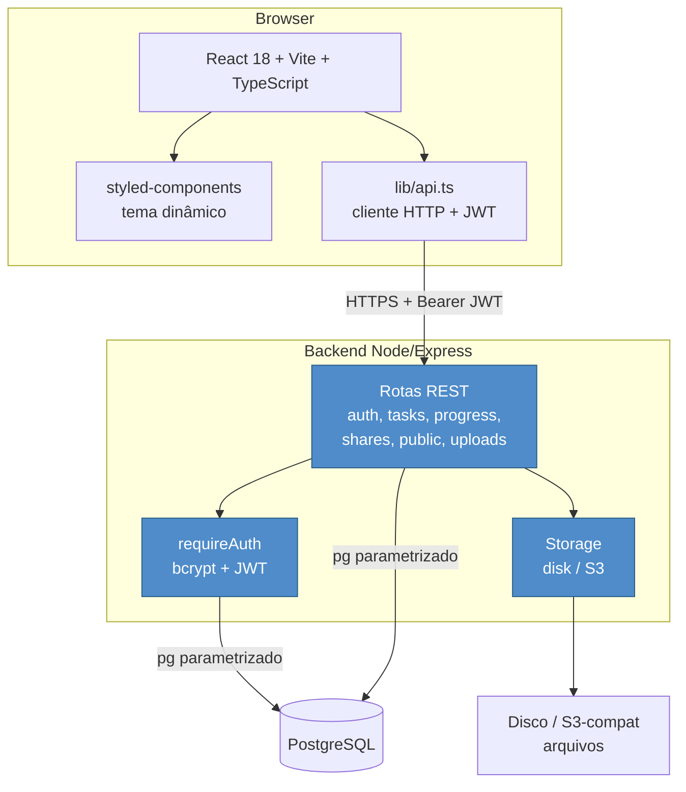
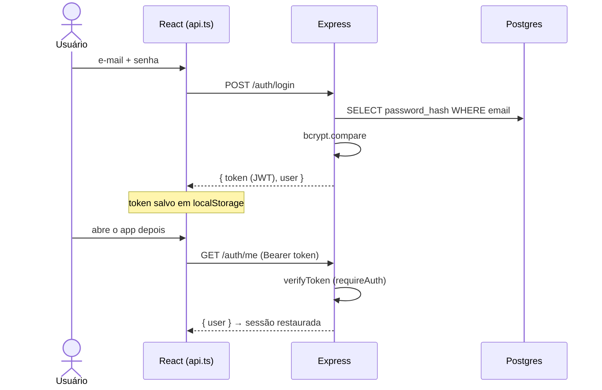
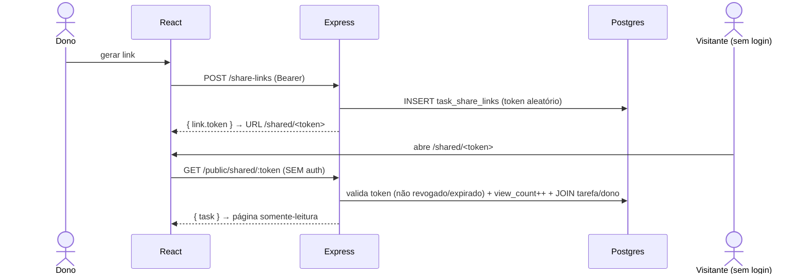

# Arquitetura

## Visão geral



A aplicação tem **três camadas próprias**: SPA no browser, API REST em Node, e PostgreSQL. O projeto nasceu sobre Supabase (BaaS) e foi migrado para esta arquitetura — o que antes era resolvido por recursos da plataforma (Auth, RLS, Realtime, Storage, RPCs) agora é código próprio no backend.

## Camadas

### Frontend (browser)
- **React 18** com hooks customizados: [useAuth](../src/hooks/useAuth.ts), [useTheme](../src/hooks/useTheme.ts), [useTasks](../src/hooks/useTasks.ts), [useProgress](../src/hooks/useProgress.ts), [useAnalytics](../src/hooks/useAnalytics.ts), [useShares](../src/hooks/useShares.ts).
- **styled-components 6** com tema dinâmico claro/escuro. Props customizadas são filtradas do DOM via `StyleSheetManager` + `@emotion/is-prop-valid`.
- **Vite 5**; code-splitting com `React.lazy` para o módulo de Análises (recharts é pesado).
- **[lib/api.ts](../src/lib/api.ts)**: único ponto de comunicação com o backend. Guarda o JWT em `localStorage` e o envia em `Authorization: Bearer`. Não há SDK de terceiros.

### Backend (Node/Express)
- **Express 4 + TypeScript**, organizado em rotas finas + libs de domínio.
- **Autenticação própria:** bcrypt para hash de senha, JWT stateless para sessão. Middleware [requireAuth](../server/src/middleware/requireAuth.ts) injeta `req.user` a partir do token.
- **PostgreSQL** via `pg`, sempre com **queries parametrizadas** ([db.ts](../server/src/db.ts)).
- **Storage** abstraído em driver: disco local (dev) ou S3-compatível (produção) — [lib/storage](../server/src/lib/storage/).
- **Validação** de todo payload com zod.

### Banco (PostgreSQL)
- Schema versionado em [db/migrations/](../db/migrations/), aplicado pelo runner idempotente [migrate.ts](../server/src/migrate.ts).
- Sem RLS: a autorização é feita no backend (ver abaixo).

## Autorização (substitui o RLS do Supabase)

No Supabase, o isolamento entre usuários vinha de políticas RLS no banco. Agora é explícito no backend: **toda query filtra por `user_id` derivado do JWT**.

```ts
// Exemplo (routes/tasks.ts) — o usuário só vê/altera o que é seu
await query('SELECT * FROM tasks WHERE user_id = $1', [req.user.id]);
await query('UPDATE tasks SET ... WHERE id = $1 AND user_id = $2', [id, req.user.id]);
```

Operações sobre recursos de outro usuário retornam **404** (não revela existência). Validado pelo `smoke:security`.

## Fluxo: autenticação



## Fluxo: criar e concluir tarefa

```mermaid
sequenceDiagram
  actor U as Usuário
  participant App as React
  participant API as Express
  participant DB as Postgres

  U->>App: nova tarefa
  App->>API: POST /tasks (Bearer)
  API->>DB: BEGIN; INSERT tasks; onTaskCreated (+10 XP, recalc locais); COMMIT
  API-->>App: { task }

  U->>App: concluir
  App->>API: POST /tasks/:id/complete
  API->>DB: UPDATE completed=true; onTaskCompleted (+50 XP, streak)
  API-->>App: { task }
  Note over App: useProgress faz polling (5s) e reflete XP/streak
```

## Fluxo: compartilhamento por link público



## Decisões arquiteturais

### 1. Backend próprio em vez de BaaS
**Trade-off:** mais código (auth, autorização, storage) que antes vinha pronto.
**Justificativa:** controle total, sem vendor lock-in nem pausa de free tier, e valor didático para o TCC (mostra auth, REST, SQL, segurança).

### 2. Autorização no backend em vez de RLS
**Trade-off:** disciplina de sempre filtrar por `user_id` em cada query.
**Justificativa:** mais simples de entender/depurar que políticas SQL; centralizado e testável (`smoke:security`).

### 3. Polling em vez de WebSocket (Realtime)
**Trade-off:** atualização a cada 5s, não instantânea.
**Justificativa:** suficiente para 1 usuário por sessão; evita complexidade de WebSocket. Só o progresso (XP/streak) precisava de "tempo real".

### 4. Storage com driver plugável (disk/S3)
**Trade-off:** uma camada de abstração a mais.
**Justificativa:** disco em dev (zero setup), S3-compatível (R2/B2/AWS) em produção, trocando uma variável de ambiente.

### 5. Lógica pura separada dos hooks/rotas
`streak.ts`, `analytics.ts`, `onboarding.ts` (frontend) e `streak.ts`/`progress.ts` (backend) são funções puras testáveis sem mockar rede/DB.

## Migração Supabase → backend próprio (resumo)

| Antes (Supabase) | Agora |
| ---------------- | ----- |
| `auth.users` + Auth | tabela `auth_users` + bcrypt + JWT |
| RLS (políticas SQL) | filtro `user_id` em cada query |
| RPCs `SECURITY DEFINER` | endpoints REST |
| Realtime (WebSocket) | polling de `GET /progress` |
| Supabase Storage | driver disk/S3 + `/uploads` |
| `@supabase/supabase-js` no front | `lib/api.ts` (fetch) |

## Organização de pastas

Ver a seção "Estrutura do projeto" no [README](../README.md).
